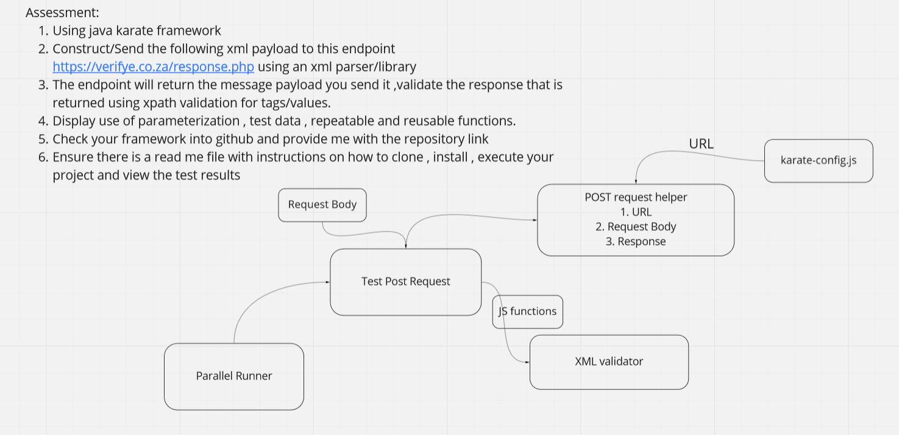

### Executing the test

Clone the repository. From the root directory of the project execute the following command.

```
mvn clean compile test

```

### Report 

The report file is located at `target/karate-report`

### Approach
