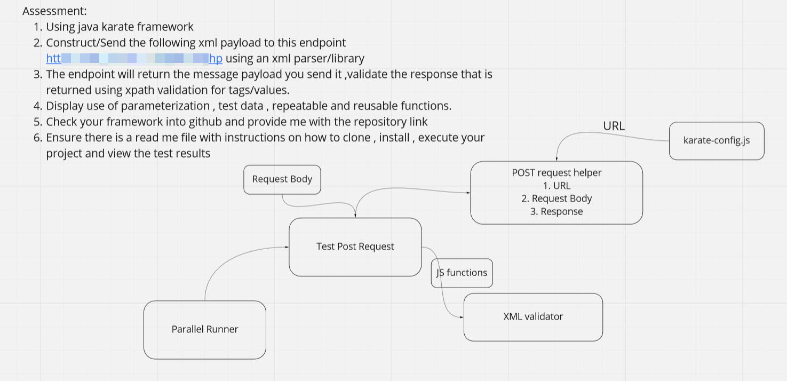

# ⚠️ I have cloned this repo as an example of how NOT to use Karate

The entire solution requires just 6 lines of code when you use Karate properly:

```cucumber
* url 'https://verifye.co.za/response.php'
* request read('classpath:com/example/post/featureFile/data/requestBody.xml')
* method post
* status 200
* match /Document/CstmrDrctDbtInitn/GrpHdr/MsgId == '021/DDINP/Puleng/20211118/2971'
* match /Document/CstmrDrctDbtInitn/PmtInf/PmtInfId == 'PULENG2005'
```

--- end of edit by [@ptrthomas](https://github.com/ptrthomas) ---

### Executing the test

Clone the repository. From the root directory of the project execute the following command.

```
mvn clean compile test

```

### Report 

The report file is located at `target/karate-report`

### Approach

